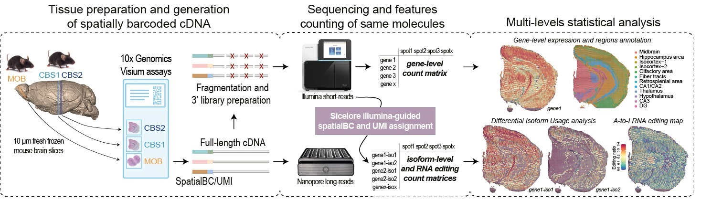

# The spatial landscape of gene expression isoforms in tissue sections

In situ capturing technologies add tissue context to gene expression data, with the potential of providing a greater understanding of complex biological systems. However, exploration of alternative splicing and full-length sequence heterogeneity is not detected through current methods, which hinders insights into the full biological complexity. Here, we introduce Spatial Isoform Transcriptomics (SiT), a method for spatial isoform and sequence heterogeneity investigation in tissue sections. 

**This github provides all R scripts required for SiT dataset analysis, SiT data are deposited throught GEO, accession number [GSE153859](https://www.ncbi.nlm.nih.gov/geo/query/acc.cgi?acc=GSE153859)**

* GSE153859_RAW.tar contains illumina and Nanopore raw data files

* GSE153859_MOB.rds.gz --> data/MOB.rds 

* GSE153859_CBS1.rds.gz --> data/CBS.rds

* GSE153859_CBS2.rds.gz --> data/CBS2.rds
